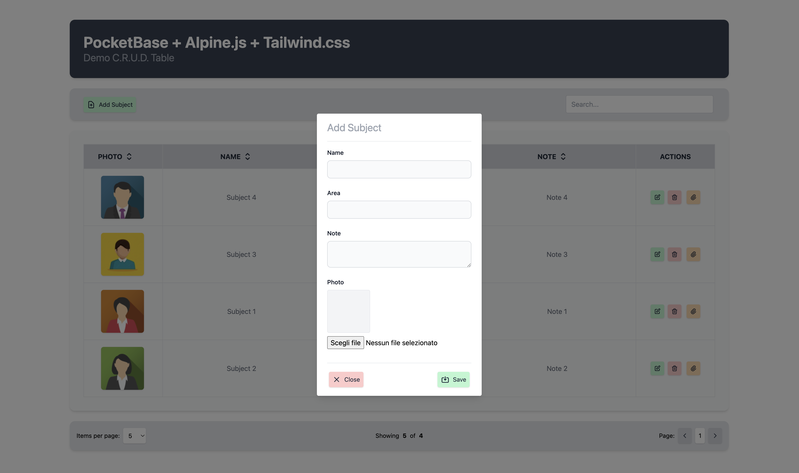
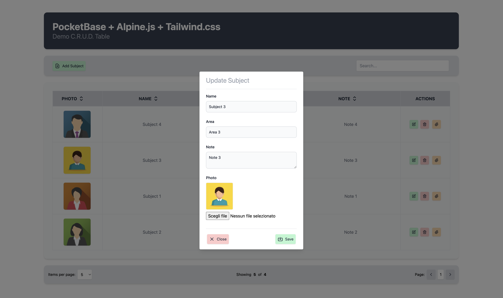

## An implementation of PocketBase with Alpine.js and Tailwind.css

### A simple table with C.R.U.D. functionalities:

- enter in the **Pocketbase** folder and type `"./pocketbase serve"` to start the server;
- you can add/edit/delete a record, upload a photo and add multiple attachments;
- the table supports **search**, **sort** and **pagination** functions;
- click on the table columns to sort the rows;
- click on the photo to open it in a new panel;
- with the dropdown menu, choose the pagination (5/10/15/20 items per page).

Tested with PocketBase vers. 0.7.6
\
\
**Login**: 
- url: http://127.0.0.1:8090/_/#/login
- e-mail: admin@example.com
- password: pocketbase

**Main Panel** (http://127.0.0.1:8090)
\
\

\
\
**Add New Item**
\
\

\
\
**Update Item**
\
\

\
\
**Add Attachments**
\
\

\
\
**PocketBase**
\
\

\
\
**Links:**
- https://pocketbase.io
- https://alpinejs.dev
- https://tailwindcss.com
